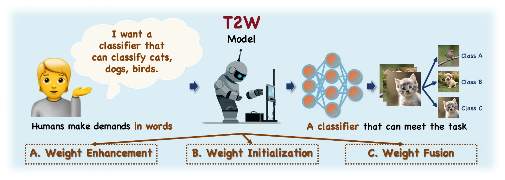
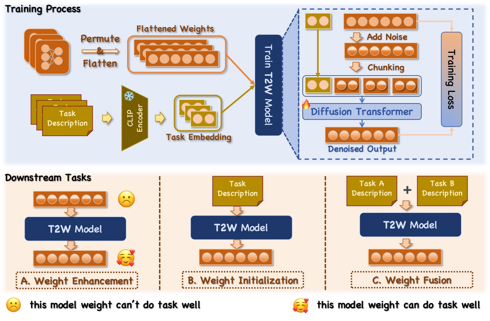

# T2W: Text-to-Weight Generation via Diffusion Transformer

<p align="center">
  
  
  
  <a href="https://dl.acm.org/doi/abs/10.1145/3746027.3755441"></a>
</p>

> **Official PyTorch Implementation of T2W Weight Generation Framework**
>
> T2W leverages Diffusion Transformer (DiT) to directly synthesize neural network weights from natural language descriptions.
>
> 📄 **Paper**: [Text2Weight: Bridging Natural Language and Neural Network Weight Spaces](https://dl.acm.org/doi/abs/10.1145/3746027.3755441) (ACM MM 2025)

<p align="center">
  
</p>

## 📖 Overview

T2W presents a novel paradigm for neural network weight generation using text-conditioned diffusion models. Given a textual description of the target task, our framework generates functional network weights that can be directly deployed for downstream classification tasks.

<p align="center">
  
</p>

### Key Features

- **Text-Conditioned Weight Synthesis**: Generate task-specific neural network weights from natural language descriptions
- **Diffusion Transformer Architecture**: Employ DiT as the generative backbone for high-quality weight generation
- **LoRA-Style Classifier Head**: Generate weights for a lightweight two-layer MLP adapter based on LoRA principles
- **Multi-Dataset Support**: Support for CIFAR-100, Caltech-256, and ImageNet benchmarks

### Method Pipeline

```
Text Description → CLIP Encoder → Condition Features → DiT → Weight Prediction → LoRA-MLP Classifier → Downstream Evaluation
```

## 🗂️ Project Structure

```
T2W/
├── T2W/                          # Core framework module
│   ├── diffusion/                # Diffusion process implementation
│   │   ├── gaussian_diffusion.py # Gaussian diffusion utilities
│   │   ├── respace.py            # Timestep respacing
│   │   └── timestep_sampler.py   # Timestep sampling strategies
│   ├── models/
│   │   └── transformer.py        # DiT model architecture
│   ├── distributed.py            # Multi-GPU training utilities
│   ├── meters.py                 # Training/testing meters
│   └── utils.py                  # General utilities
├── data_gen/                     # Dataset generation scripts
│   ├── cifar100/                 # CIFAR-100 data generation
│   │   ├── generate_config.py    # Step 1: Generate task configurations
│   │   ├── generate_dataset.py   # Step 2: Train adapters and generate weights
│   │   ├── dataset_config.py     # Step 3: Build dataset with CLIP features
│   │   ├── normalization.py      # Weight normalization utilities
│   │   └── p_dataset.py          # PyTorch dataset for training
│   ├── caltech256/               # Caltech-256 data generation
│   └── imagenet/                 # ImageNet data generation
├── configs/                      # Hydra configuration files
│   ├── train/                    # Training configurations
│   └── test/                     # Testing configurations
├── main.py                       # Main training script (CIFAR-100)
├── eval.py                       # Evaluation/inference script (CIFAR-100)
├── vis.py                        # Visualization utilities
└── LICENSE
```

## 🔧 Requirements

### Environment Setup

```bash
# Create conda environment
conda create -n t2w python=3.10
conda activate t2w

# Install PyTorch (adjust CUDA version as needed)
pip install torch>=2.0.0 torchvision>=0.15.0 --index-url https://download.pytorch.org/whl/cu118

# Install dependencies
pip install clip
pip install torchmetrics
pip install tqdm
pip install numpy
```

### Hardware Requirements

- **GPU**: NVIDIA GPU with at least 24GB VRAM (recommended: A100, RTX 4090)
- **RAM**: 32GB+ system memory
- **Storage**: 50GB+ for datasets and checkpoints

## 📊 Data Generation

The data generation pipeline creates (text, weight) pairs for training T2W. Each sample consists of:
- **Text Features**: CLIP-encoded features of task descriptions (512-dim)
- **Weight**: Pre-trained LoRA-style MLP classifier weights for the corresponding task

### Overview

The data generation process involves three sequential steps:

| Step | Script | Description |
|------|--------|-------------|
| 1 | `generate_config.py` | Generate random task configurations (class combinations) |
| 2 | `generate_dataset.py` | Train adapter weights for each task |
| 3 | `dataset_config.py` | Build final dataset with CLIP text features |

### Step-by-Step Guide

#### Step 1: Generate Task Configurations

This script generates random combinations of classes to create diverse training tasks.

```bash
cd data_gen/cifar100

# Generate task configurations
python generate_config.py
```

**Output**: `data_point.json` - Contains task configurations with randomly selected class subsets.

**Configuration Options** (modify in script):
- `data_point`: Number of tasks to generate (default: 12000)
- `class_num_range`: Range of classes per task (default: 8-32)

#### Step 2: Train Adapter Weights

This script trains LoRA-style MLP adapters for each task configuration.

```bash
# First, train the base model on all classes
python generate_dataset.py 0 1 0  # args: begin, end, gpu_id

# Modify the script to call train_base() first (uncomment in __main__)
# This generates: checkpoints/base.pt
```

After obtaining `base.pt`, train task-specific adapters:

```bash
# Train task adapters (can be parallelized across GPUs)
python generate_dataset.py 0 3000 0      # GPU 0: tasks 0-3000
python generate_dataset.py 3000 6000 1   # GPU 1: tasks 3000-6000
python generate_dataset.py 6000 9000 2   # GPU 2: tasks 6000-9000
python generate_dataset.py 9000 12000 3  # GPU 3: tasks 9000-12000
```

**Arguments**:
- `begin`: Starting task index
- `end`: Ending task index
- `gpu_id`: CUDA device ID

**Output**: `checkpoints/{task_id}/task.pt` - Adapter weights for each task

#### Step 3: Build Dataset with CLIP Features

This script processes the trained weights and generates CLIP text features for conditioning.

```bash
python dataset_config.py
```

**Output**:
- `train.json`: Training dataset (80% of samples)
- `val.json`: Validation dataset (20% of samples)

### Data Format

Each JSON entry has the following structure:

```json
{
  "index": 0,
  "selected_classes": ["dog", "cat", "bird", ...],
  "text_features": [0.023, -0.156, ...],
  "path": "checkpoints/0/task.pt"
}
```

### Dataset-Specific Instructions

<details>
<summary><b>CIFAR-100</b></summary>

```bash
cd data_gen/cifar100

# Step 1: Generate configurations
python generate_config.py

# Step 2: Train base model
# Edit generate_dataset.py: uncomment train_base() in __main__
python generate_dataset.py 0 1 0

# Step 2b: Train task adapters
# Edit generate_dataset.py: uncomment train_task() in __main__
python generate_dataset.py 0 12000 0

# Step 3: Build dataset
python dataset_config.py
```

</details>

<details>
<summary><b>Caltech-256</b></summary>

```bash
cd data_gen/caltech256

# Download Caltech-256 dataset first
# Extract to: ./data/caltech256/256_ObjectCategories/

# Then follow the same steps as CIFAR-100
python generate_config.py
python generate_dataset.py 0 1 0        # Train base
python generate_dataset.py 0 12000 0    # Train tasks
python dataset_config.py
```

</details>

<details>
<summary><b>ImageNet</b></summary>

```bash
cd data_gen/imagenet

# Ensure ImageNet is downloaded and extracted
# Update the data path in generate_dataset.py

# Follow the same steps as CIFAR-100
python generate_config.py
python generate_dataset.py 0 1 0        # Train base
python generate_dataset.py 0 12000 0    # Train tasks
python dataset_config.py
```

</details>

## 🚀 Training

> **Note**: The current `main.py` is configured for the **CIFAR-100** dataset. To train on other datasets (Caltech-256, ImageNet), you need to modify the dataset in `main.py` accordingly.

### Single GPU Training

```bash
python main.py --config-name cifar100_classifier
```

### Key Configuration Options

Modify `configs/train/cifar100_classifier.yaml` to adjust training parameters:

```yaml
# Basic settings
amp: false                    # Automatic Mixed Precision
num_gpus: 1                   # Number of GPUs
exp_name: cifar100_classifier # Experiment name
resume_path: null             # Path to resume from checkpoint

# Dataset settings
dataset:
  normalizer: openai          # Weight normalization strategy
  openai_coeff: 1.646         # Normalization coefficient
  num_workers: 8              # Data loading workers

# Transformer architecture
transformer:
  ema: true                   # Use Exponential Moving Average
  predict_xstart: true        # Predict x_start directly
  chunk_size: 576             # Token chunk size
  n_embd: 2048                # Embedding dimension
  n_layer: 12                 # Number of transformer layers
  n_head: 16                  # Number of attention heads

# Training hyperparameters
train:
  base_lr: 4e-4               # Base learning rate
  num_ep: 15000               # Number of epochs
  mb_size: 550                # Batch size
  ema_decay: 0.9999           # EMA decay rate
  grad_clip: 0.1              # Gradient clipping
```

### Checkpoints

Checkpoints are saved to `results/{exp_name}/checkpoints/`:
- `best.pt`: Best performing model
- `{epoch:04d}.pt`: Periodic checkpoints

## 📈 Evaluation & Inference

> **Note**: The current `eval.py` is configured for the **CIFAR-100** dataset. To evaluate on other datasets, you need to modify the dataset paths and configurations in `eval.py` accordingly.

### Run Inference

Use `eval.py` to generate weights and evaluate them on downstream classification tasks:

```bash
python eval.py --config-name cifar100_classifier
```

### Configuration

Before running evaluation, modify the configuration variables at the top of `eval.py`:

```python
# Configuration: modify these paths according to your setup
DATA_ROOT = "./data/cifar100"
CHECKPOINT_PATH = "./results/cifar100_classifier/checkpoints/best.pt"
```

### Evaluation Process

The evaluation script performs the following steps:

1. **Load T2W Model**: Load the trained T2W checkpoint
2. **Sample Weights**: Generate neural network weights from text conditions using the diffusion process
3. **Build Classifiers**: Convert generated weights to functional classifier networks
4. **Evaluate**: Test the generated classifiers on downstream CIFAR-100 classification tasks

### Evaluation Metrics

The framework reports:
- **Classification Accuracy**: Top-1 accuracy on the test set
- **MSE Loss**: Mean squared error between generated and ground-truth weights

### Example Evaluation Output

```
Using device: cuda:0
Now Sample: torch.Size([32, 17424])
ADAPTED Accuracy: 78.45%
```

### Output Files

Evaluation results are saved to:
- `cifar100_eval_results.json`: Contains accuracy and loss for each batch

## 🏗️ Model Architecture

### DiT (Diffusion Transformer)

The core generative model uses a Transformer architecture adapted for diffusion:

```
Input Parameters (Noised) → Token Encoding → Positional Embedding
                                    ↓
                        Multi-Head Self-Attention (×N layers)
                                    ↓
                        Token Decoding → Output Parameters
```

Key components:
- **Parameter Encoder**: Projects weight chunks into transformer token embeddings
- **Frequency Embedder**: Encodes diffusion timesteps using sinusoidal features
- **CLIP Condition**: Integrates text features as additional conditioning tokens

### Weight Structure

Generated weights correspond to a two-layer MLP adapter:
- `linear1.weight`: (hidden_dim × 512) - First layer weights
- `linear1.bias`: (hidden_dim,) - First layer bias
- `linear2.weight`: (512 × hidden_dim) - Second layer weights
- `linear2.bias`: (512,) - Second layer bias

Total parameters: ~17K (with hidden_dim=16)

## 📄 Citation

If you find this work useful, please consider citing:

```bibtex
@inproceedings{tian2025text2weight,
  title={Text2Weight: Bridging Natural Language and Neural Network Weight Spaces},
  author={Tian, Bowen and Chen, Wenshuo and Li, Zexi and Lai, Songning and Wu, Jiemin and Yue, Yutao},
  booktitle={Proceedings of the 33rd ACM International Conference on Multimedia},
  pages={10152--10160},
  year={2025}
}
```

## 📜 License

This project is licensed under the MIT License - see the [LICENSE](LICENSE) file for details.

## 🙏 Acknowledgments

This codebase builds upon several excellent open-source projects:
- [OpenAI CLIP](https://github.com/openai/CLIP)
- [G.pt](https://github.com/wpeebles/G.pt)
- [minGPT](https://github.com/karpathy/minGPT)

## 📧 Contact

For questions and issues, please open an issue on this repository or contact the authors directly.
